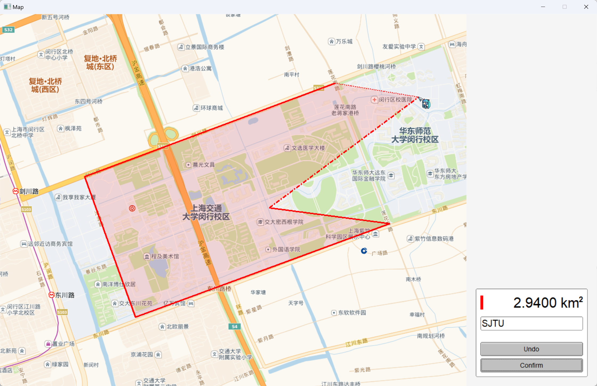
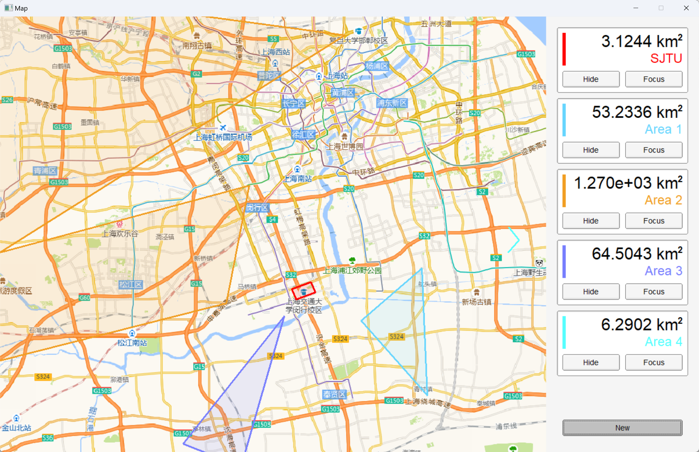
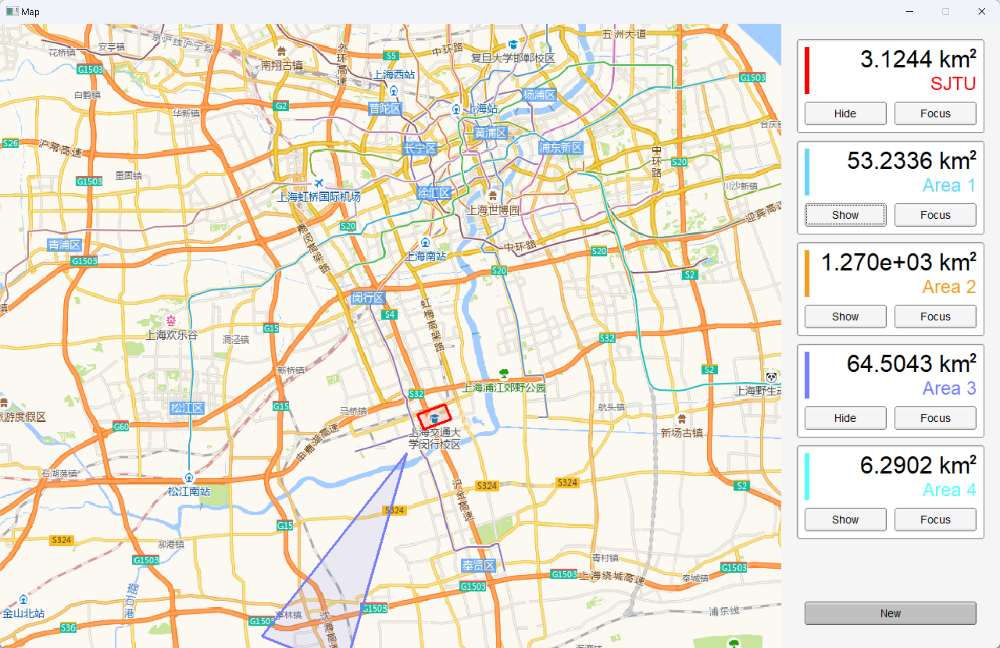
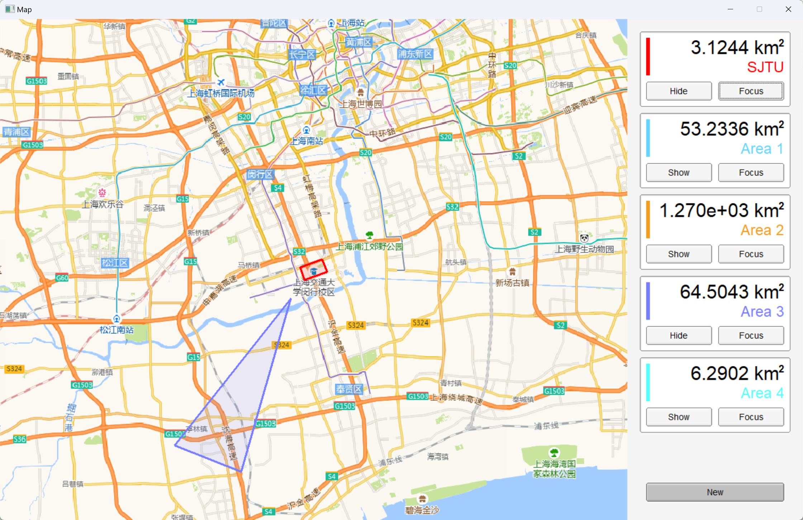

# fltk_map

- [fltk\_map](#fltk_map)
  - [功能预览 / 说明](#功能预览--说明)
  - [运行说明](#运行说明)
    - [Visual Studio (推荐)](#visual-studio-推荐)
    - [WSL2 (Ubuntu-20.04)](#wsl2-ubuntu-2004)
    - [Msys2](#msys2)


本项目是使用 [`fltk`](https://github.com/fltk/fltk/) GUI 库, 以 C++ 语言编写的地图查看程序.

程序的主要功能包括地图查看, 区域创建和管理, 面积计算与显示等等. 欢迎下载试用本项目, 以及对本项目提出建议 / 提交 issue 和 pr .

能力所限, 您可能在本项目中遇见包括但不限于以下情形: 不优雅的实现方式 / 未完善的功能 / 混乱的逻辑 / 反常的交互 / 漫天飞舞的Bug / 神志不清的作者, 敬请谅解.

于是, 这里是留给可能由于我的代码遭受精神创伤的你的补偿 (bushi
```
  ／l、 
（ﾟ､ 。 ７
  l、 ~ヽ
  じしf_, )ノ
```
猫猫可爱捏~

## 功能预览 / 说明


本项目主要实现了以下功能:

<details> <summary> 创建和编辑区域 </summary>



</details>

- 默认即处于编辑区域的状态, 通过点击在地图对应位置添加顶点.
- 通过右下角 `Confirm / New` 按钮确认或新建区域, 通过 `Undo` 按钮撤销上一个添加的点.
- 编辑状态下实时显示区域面积 (若区域合法)
- 在输入框中输入文本以修改区域名称, 留空以使用默认名称.

<details> <summary> 查看多个区域 </summary>


</details>

- 程序将按照创建顺序显示多个区域的面积和名称. 
- 根据区域数目, 自动生成滚动条.
- 屏幕外的区域将自动显示方位指示器.

<details> <summary> 缩放 / 移动地图 </summary>



</details>

- 通过鼠标拖动和滚轮对地图进行缩放.
- 程序将自动选取并下载适合的分辨率/详细程度进行显示.

<details> <summary> 管理已创建的区域 </summary>





</details>

- 点击区域显示中的 `Show / Hide` 按钮以切换显示状态.
- 点击 `Focus` 将视角移动至区域中心.


## 运行说明

### Visual Studio (推荐)

Clone 本存储库, 然后使用 Visual Studio 打开 `fltk_map.sln` .

建议使用 vcpkg 管理和安装依赖项 `fltk` 与 `libx11` .

### WSL2 (Ubuntu-20.04)

使用 apt-get 安装 `libfltk1.3-dev` 与 `libx11-dev`

下载 `res/wsl/map_main.cpp` 与 `map_test/httplib.h` 并将其放入目标文件夹, 然后使用如下命令编译:

```
g++ -std=c++2a -g ./map_main.cpp -lfltk -lfltk_images -lfltk_images -lX11 -pthread -o map_main
```

> 请注意, `res/wsl/map_main.cpp` 仅为测试使用, 可能不会与最新状态和功能保持同步.

### Msys2

经过测试, 本项目不能通过 msys2 编译运行, 主要原因是 `libx11` 无法在 msys2 中安装

如果您可以成功使用 msys2 编译运行本项目, 欢迎 pull request / 直接联系我