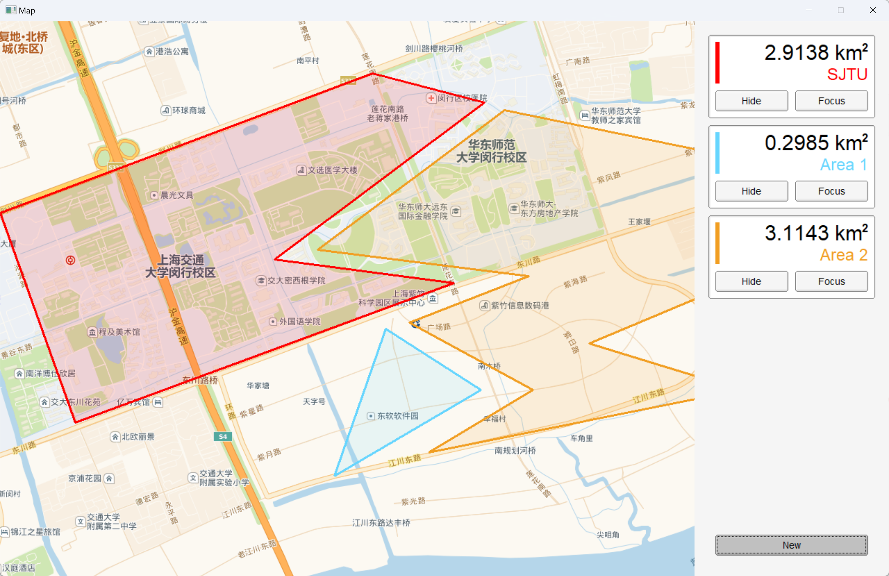

# fltk_map

- [fltk\_map](#fltk_map)
  - [功能预览 / 说明](#功能预览--说明)
  - [问题陈述](#问题陈述)
    - [地图读入和显示](#地图读入和显示)
    - [数据输入和表示](#数据输入和表示)
    - [面积计算](#面积计算)
    - [多边形显示](#多边形显示)
  - [运行说明](#运行说明)
    - [Visual Studio (推荐)](#visual-studio-推荐)
    - [Linux / WSL2 (Ubuntu-20.04)](#linux--wsl2-ubuntu-2004)
    - [Msys2](#msys2)
    - [Vscode](#vscode)


本项目是使用 [`fltk`](https://github.com/fltk/fltk/) GUI 库, 以 C++ 语言编写的地图查看程序.

程序的主要功能包括地图查看, 区域创建和管理, 面积计算与显示等等. 欢迎下载试用本项目, 以及对本项目提出建议 / 提交 issue 和 pr .

能力所限, 您可能在本项目中遇见包括但不限于以下情形: 不优雅的实现方式 / 未完善的功能 / 混乱的逻辑 / 反常的交互 / 胡言乱语的注释 / 漫天飞舞的Bug / 神志不清的作者, 敬请谅解.

于是, 这里是留给可能由于我的代码遭受精神创伤的你的补偿 (bushi
```
  ／l、 
（ﾟ､ 。 ７
  l、 ~ヽ
  じしf_, )ノ
```
猫猫可爱捏~

## 功能预览 / 说明


本项目主要实现了以下功能:

<details> <summary> 创建和编辑区域 </summary>


> 由于 Gif 图片格式问题, 颜色可能出现失真

</details>

- 默认即处于编辑区域的状态, 通过点击在地图对应位置添加顶点.
- 通过右下角 `Confirm / New` 按钮确认或新建区域, 通过 `Undo` 按钮撤销上一个添加的点.
- 编辑状态下实时显示区域面积 (若区域合法)
- 在输入框中输入文本以修改区域名称, 留空以使用默认名称.

<details> <summary> 查看多个区域 </summary>




</details>

- 程序将按照创建顺序显示多个区域的面积和名称. 
- 根据区域数目, 自动生成滚动条.
- 屏幕外的区域将自动显示方位指示器.

<details> <summary> 缩放 / 移动地图 </summary>


> 由于 Gif 图片格式问题, 颜色可能出现失真

</details>

- 通过鼠标拖动和滚轮对地图进行缩放.
- 程序将自动选取并下载适合的分辨率/详细程度进行显示.

<details> <summary> 管理已创建的区域 </summary>


> 由于 Gif 图片格式问题, 颜色可能出现失真

</details>

- 点击区域显示中的 `Show / Hide` 按钮以切换显示状态.
- 点击 `Focus` 将视角移动至区域中心.


## 问题陈述

### 地图读入和显示

为了实现自由拖动 / 缩放地图的功能, 简化用户操作, 提高可用性, 本项目采用了**高德WMTS瓦片地图服务**作为地图图源.

瓦片地图模型是一种多分辨率层次模型, 通过**根据需要的显示范围选取适合的精度层次**, 程序将能够位用户提供精确, 直观的地图浏览体验. 下图是对瓦片地图不同层次的展示:


另外, 采用瓦片地图服务使得程序可以**并行请求和显示**多张小图片 (使用 `<thread>` 库) , 并在本地**构建索引和缓存** (由自己实现), 进一步提高运行效率.


### 数据输入和表示

通过捕获和处理鼠标事件, 本项目实现了符合直觉的交互逻辑. 用户可以通过鼠标点击和移动设定坐标点, 并实时处理面积数据显示在侧边栏中. 如果用户所绘制的多边形非法, 程序将停止计算面积并给出提示. (交互介绍详见 [功能预览 / 说明](#功能预览--说明))

在程序内部, 鼠标事件的坐标被转换为地图上对应的**墨卡托投影坐标**. 墨卡托投影是一种正轴等角圆柱投影, 程序采用的墨卡托投影坐标与经纬度坐标的换算公式为:

$$
\left\{\begin{align}
x &= \frac{\lambda}{2\pi} + 0.5, \\
y &= 0.5 - \frac{\ln (\tan\phi + \frac{1}{\cos\phi} )}{2\pi} 
\end{align}\right.
$$

其中 $\lambda, \phi$ 为弧度制下经纬度，$x, y$ 为墨卡托坐标 (为了便于存储和计算, 程序将坐标转化为了 $[0,1]$ 间的浮点数, 而不是对应的弧度值)

墨卡托投影是地图常用的投影方法. 瓦片地图也采用了该投影方法, 因此程序能够便捷地实现地图切片的处理与显示. 不过该投影方式严重扭曲了大陆间的比例 (见下图) , 因此**不能在其上直接计算面积**. 具体替代方法在下一小节讨论.


### 面积计算

由于墨卡托投影变换并非等积变换 (两极面积相对于赤道处显著放大) , 本程序采用**球面三角形**法计算多边形的面积.

球面三角形是指球面上的三个点用三个大圆弧联结起来所形成的图形, 如下图左侧. 不过这造成了实际计算范围与显示的不一致: 如下图右侧, 墨卡托投影上的直线 (蓝色) 与大圆 (红色) 存在差距, 但这种差距仅会在极大的范围下才会体现. 因此本方法仍**对绝大多数情况有效**, 同时与实际值的对比也证实了程序具有良好的准确性.


球面三角形面积可由 $S=(A+B+C-\pi) \cdot R^2$ 计算得出. 本程序使用了一些 "简单的几何学知识" 计算出了给定经纬度坐标的若干点之间的球面方位角:


$$
\theta = \mathrm{arctan2}\frac{\sin\Delta\lambda \, \cos\phi_{2} }{\cos\phi_{1} \, \sin\phi_{2} - \sin\phi_{1} \, \cos\phi_{2} \, \cos\Delta\lambda }
$$

$\lambda, \phi$ 为弧度制下经纬度, $\theta$ 为 P 到 Q 点的起始方位角. $arctan2$ 为一种特殊的反正切函数, 使用 `std::atan2()` 计算. 计算出三角形每条边的起始方位角后即可得到内角大小, 进一步由前述面积公式求得单个三角形的 (有向) 面积. 将区域分割为多个三角形后分别计算再相加, 可以很好地计算凸 / 凹多边形等多种情形下的面积.


### 多边形显示

由于引入了地图的拖动 / 缩放功能, 多边形区域将需要**动态生成和显示**.

程序首先根据视角位置和显示范围推算出多边形每个点在屏幕上的坐标, 多边形边界即可使用 `fl_draw` 中的函数绘制得出.

而由于 `fltk` 本身不支持透明度通道, 本项目手动完成了对应功能的实现以创建半透明的多边形填充. 程序首先通过射线法得到屏幕内一条水平射线上的交点信息, 然后在处于多边形内部的两交点间将半透明像素填入图像缓冲区. 最后由缓冲区生成含有 alpha 通道的图片并显示在对应位置上.

关于性能优化, 程序通过维护区域的包围盒, 自动剔除不在屏幕内的区域并显示指示器. 同时, 每个区域的图像缓冲区的实际大小都只有屏幕显示面积的 1/10, 减小了填充的运算量. 此外, 如果可能, 程序将一次绘制完整的区域并保存 `Anchor` 信息, 后续非缩放变换只需要改变图片显示位置, 而无需重新绘制.

通过以上措施, 程序实现了流畅, 清晰的显示和交互体验. 即使绘制多个重叠区域也不会出现明显卡顿.


## 运行说明

### Visual Studio (推荐)

Clone 本存储库, 然后使用 Visual Studio 打开 `fltk_map.sln` .

建议使用 vcpkg 管理和安装依赖项 `fltk` 与 `libx11` .

### Linux / WSL2 (Ubuntu-20.04)

使用 `apt-get` 安装 `libfltk1.3-dev` 与 `libx11-dev`

Clone 本存储库, 然后在存储库目录下使用如下命令编译:

```
g++ -std=c++2a -g ./map_test/map_main.cpp -lfltk -lfltk_images -lX11 -pthread -o map_main
```

### Msys2

使用 `Msys2` 安装 `fltk` (建议在 `mingw64` 环境下安装和编译)

Clone 本存储库然后使用如下命令编译:

```
g++ -std=c++20 -g .\map_test\map_main.cpp -lfltk -lfltk_images -lwsock32 -lws2_32 -lgdi32 -o map_main.exe
```

### Vscode

本段是针对 Vscode 的额外说明. 首先您应当按照上方 [Linux / WSL2](#linux--wsl2-ubuntu-2004) / [Msys2](#msys2) 章节所述内容配置依赖项与下载对应文件, 之后您可以参考本项目目录 `res/tasks/*.json` 配置 Vscode 自动生成的 `./map_test/.vscode/tasks.json` 文件.

`tasks.json` 应当会在运行一次 `map_test/map_main.cpp` 后自动生成. 请主要参考并修改 `"args"` 参数, 因为其它参数 (包括编译器路径与命令) 取决于个人的环境配置而有所不同.